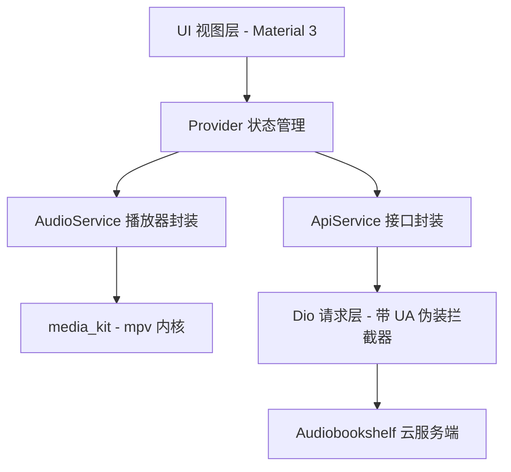

# ListenShell

<p align="center">
  
</p>

<p align="center">
  <strong>基于 Flutter + media_kit 开发的精美、高性能 Windows 有声书桌面客户端</strong>
</p>

---

**ListenShell** 是一个专为 Windows 平台优化的有声书播放客户端，完美对接 **Audiobookshelf (ABS)** 服务端协议。

为了应对部分私有有声书服主对网页播放和非官方客户端的严格风控，ListenShell 在网络传输层和底层媒体引擎中都加入了深度 **User-Agent 伪装**，完美隐藏桌面端特征，安全无忧。

---

## 🌟 核心功能

* 🛡️ **深层网络伪装**：
  * **API 网络层**：Dio 拦截器自动对所有的 API 请求附加伪装 User-Agent（默认伪装为 Android 官方客户端 `Audiobookshelf/Android`，且支持在登录和设置界面自定义）。
  * **封面图片层**：所有网络封面请求自动携带定制 Headers，突破服主对非 App 客户端的图片拉取拦截。
  * **底层媒体引擎层**：底层 mpv 播放器流请求同样附带伪装 UA，彻底规避播放网络音频流时被服务器封禁的风险。
* ⚡ **高性能 mpv 播放引擎 (media_kit)**：
  * 原生支持平滑的倍速播放 (`0.5x ~ 3.0x`)，调整倍速时不失真、不发生断音。
  * 完美处理音频流媒体缓存与断点续传。
* 🔄 **双向进度云同步**：
  * 内置进度同步计时器，**每 10 秒**向 Audiobookshelf 云端同步一次播放进度。
  * 当点击“暂停”、“切换章节”或“关闭程序”时立即触发强制同步，换机收听无缝衔接。
* 🎨 **高质感 Material 3 桌面交互**：
  * 精心挑选的深色护眼主题，适合夜晚收听环境。
  * 包含响应式侧边导航栏，支持多书库快速切换以及全库实时搜索。
  * 底部常驻迷你播放条与大尺寸磨砂悬浮播放控制台，支持无抖动 Slider 拖拽和快捷章节跳转。

---

## 🏗️ 架构设计



---

## 🚀 下载与运行

### 1. 直接下载（推荐）
我们配置了 GitHub Actions 持续集成工作流。您可以直接免编译下载运行：
1. 前往本仓库的 **[Actions](https://github.com/HMuSeaB/listenshell/actions)** 页面。
2. 点击最近一次成功的 **"Build and Release Windows App"** 运行记录。
3. 滚动到页面底部，在 **Artifacts (产物)** 列表中下载 **`listenshell-windows-binary`** 压缩包。
4. 解压并直接双击运行 `listenshell.exe`。

*(提示：打 Tag 推送如 `v1.0.0` 时，系统会自动将编译好的包挂载在 **Releases** 页面中。)*

### 2. 本地开发与调试
要在本地编译和运行该项目，您需要安装 [Flutter SDK](https://flutter.dev/)。

```powershell
# 1. 克隆代码并进入项目目录
git clone https://github.com/HMuSeaB/listenshell.git
cd listenshell

# 2. 获取依赖项
flutter pub get
```

#### 💡 本地 CMake 编译 mpv 依赖报错解决办法：
由于 `media_kit` 编译时需从海外下载 mpv 的 `.7z` 原生依赖包，若本地网络下载中断，会导致 CMake 校验失败。您可以手动绕过下载：
1. 浏览器或使用工具手动下载：[mpv-dev-x86_64-20230924-git-652a1dd.7z](https://github.com/media-kit/media-kit/releases/download/dependencies/mpv-dev-x86_64-20230924-git-652a1dd.7z)。
2. 在项目目录中手动创建文件夹：`build/windows/x64/`。
3. 将下载的 `mpv-dev-x86_64-20230924-git-652a1dd.7z` 文件（**不要解压**）直接放入 `build/windows/x64/` 中。
4. 运行调试：
   ```powershell
   flutter run -d windows
   ```

---

## 📄 许可证

本项目基于 MIT 许可证开源。请遵守您所在有声书服务器的使用规则，严禁将本客户端用于任何违反服务条款的场景。
